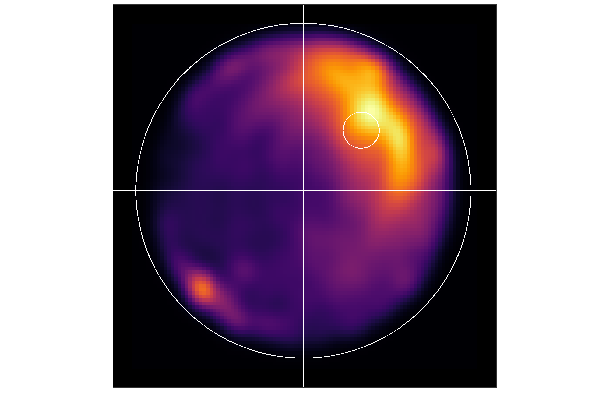

# mazeswimmer
Functions for heatmap visualizations for <a href = "https://www.anymaze.co.uk/index.htm">ANY-maze</a> and <a href = "https://www.noldus.com/ethovision-xt?gclid=CjwKCAjw8df2BRA3EiwAvfZWaEUUB2XuWLB0lj46jpyLye7E0R4dmMyVFq5x7_p1giBCKf-l8o7_0BoC8tIQAvD_BwE">Ethovision</a> formats.

With the example data (for ANY-maze), you can create the following plots:

<b>A static image</b>
</img>

<b>A dynamic image</b>
</img>
